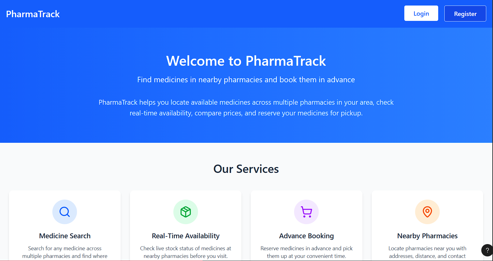
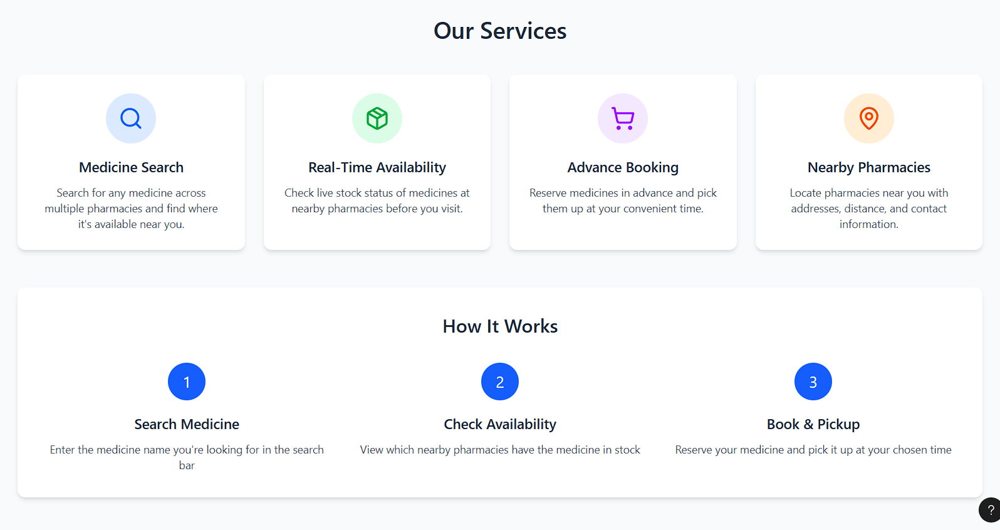
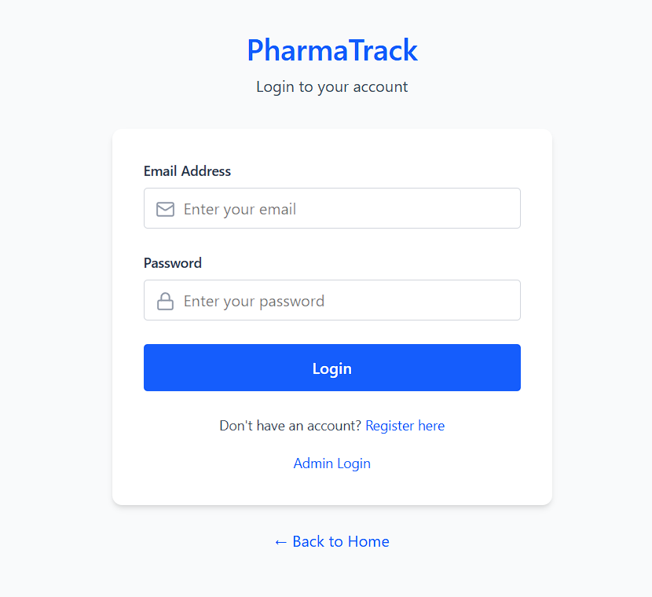
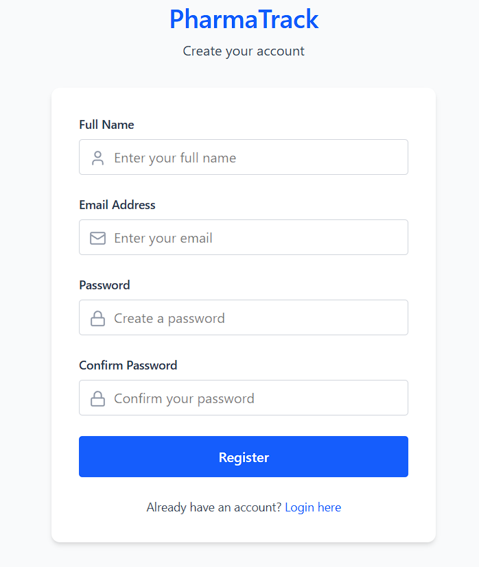
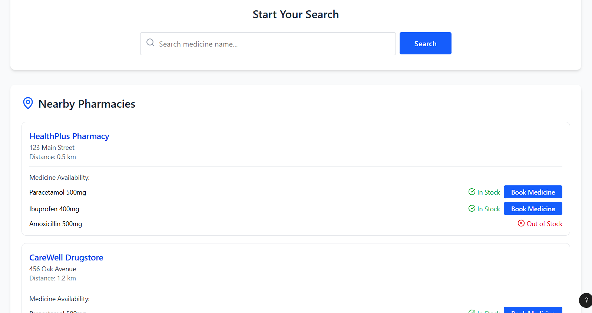
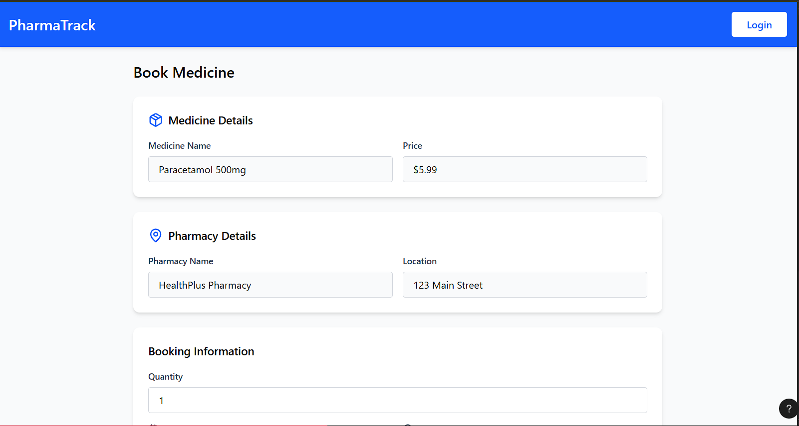
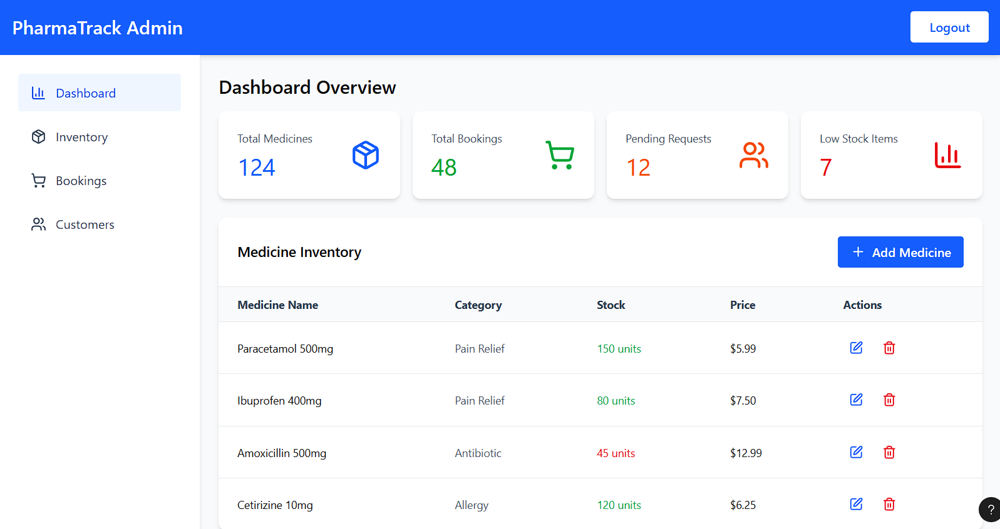

# CareMeds  
Medicine Availability and Booking System

---

## Team Members

### 1. MD. Mushfiqur Rahman  
- **Roll:** 20230104099  
- **Email:** mushfiqur.cse.20230104099@aust.edu  
- **Role:** Team Lead & Backend Developer  

### 2. MD. Mahedi Hasan Oni  
- **Roll:** 20230104098  
- **Email:** mahedi.cse.20230104098@aust.edu  
- **Role:** Frontend Developer  

### 3. Maimuna Momtaj Emu  
- **Roll:** 20230104078  
- **Email:** maimuna.cse.20230104078@aust.edu  
- **Role:** Frontend Developer  

### 4. Sabikun Alam  
- **Roll:** 20230104095  
- **Email:** sabikun.cse.20230104095@aust.edu  
- **Role:** Backend Developer  

---

## Project Overview

### Project Title  
**CareMeds – Medicine Availability and Booking System**

### Objective  
The objective of this project is to develop a web-based system that helps users easily check the availability of medicines in nearby pharmacies and reserve medicines in advance.  
The system aims to reduce the difficulty of searching for medicines physically and prevent situations where medicines get sold out before the user arrives.

---

## Target Audience
- General users looking for medicines  
- Pharmacy owners and staff  
- Patients who need urgent or regular medicines  

---

## Tech Stack

### Backend
- Laravel (PHP Framework)

### Frontend
- React  
- HTML, CSS, JavaScript  

### Database
- MySQL  

### Rendering Method
- Server-Side Rendering (SSR)

---

## UI Design

### Home Page
  

### Login Page

### Register Page

### Search Page

### Booking Page

### Pharmacy UI

---

## Project Features
- User authentication system (Sign Up / Login)  
- Role-based access (User & Pharmacy Admin)  
- Medicine availability listing by pharmacy  
- Medicine booking and reservation system  
- CRUD operations for:
  - Medicines  
  - Pharmacies  
  - Bookings  
- Search and filter medicines  
- Basic booking confirmation system  

---

## API Endpoints (Approximate)
- `GET /medicines` – Fetch available medicines  
- `POST /medicines` – Add new medicine  
- `GET /pharmacies` – Fetch pharmacy list  
- `POST /bookings` – Book a medicine  
- `GET /bookings` – View user bookings  

---

## Milestones

### Milestone 1: Project Setup & Basic Structure
- Set up Laravel project  
- Database design and migrations  
- User authentication (Login/Register)  
- Basic UI pages  

### Milestone 2: Core Features Development
- Medicine CRUD operations  
- Pharmacy management  
- Medicine availability display  
- Search and filter functionality  

### Milestone 3: Booking System & Finalization
- Medicine booking and reservation logic  
- Booking history for users  
- Admin dashboard for pharmacies  
- UI polishing and testing  
